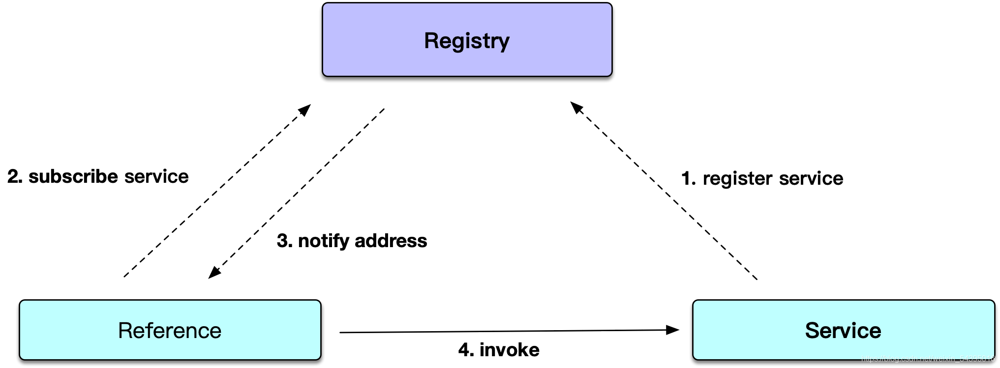
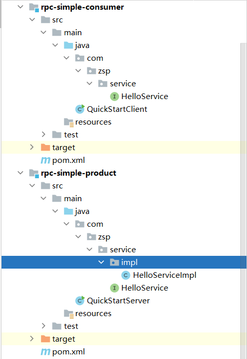

# SOFA的学习

本次SOFA的学习会划分为三大部分：

* SOFA-RPC（类似dubbo、feign、openfeign，就是个远程服务调用）
* SOFA-BOOT
* 整合SOFA-RPC和SOFA-BOOT

## SOFA-RPC

​	SOFARPC 最早源于阿里内部的 HSF，是近期蚂蚁金服开源的一个高可扩展性、高性能、生产级的 Java RPC 框架。SOFA-RPC 在蚂蚁金服已经历了十多年的发展，致力于简化应用之间的 RPC 调用。为应用提供方便透明、稳定高效的点对点远程服务调用方案。

​	为了用户和开发者方便的进行功能扩展，SOFA-RPC 提供了丰富的模型抽象和可扩展接口，包括过滤器、路由、负载均衡等。同时围绕 SOFA-RPC 框架及其周边组件提供丰富的微服务治理方案。

### 功能特性

- 透明化、高性能的远程服务调用
- 支持多种服务路由及负载均衡策略
- 支持多种注册中心的集成
- 支持 bolt、rest、dubbo 等多种通信协议
- 支持同步、单向、回调、泛化等多种调用方式
- 支持集群容错、服务预热、自动故障隔离
- 强大的扩展功能，可以按需扩展各个功能组件

### 实现原理



* 服务发布

> 当一个 SOFARPC 的应用启动的时候，如果发现当前应用需要发布 RPC 服务的话，那么 SOFARPC 会将这些服务注册到服务注册中心上。如图中 Service 指向 Registry。

* 服务订阅

> 当引用这个服务的 SOFARPC 应用启动时，会从服务注册中心订阅到相应服务的元数据信息。服务注册中心收到订阅请求后，会将发布方的元数据列表实时推送给服务引用方。如图中 Registry 指向 Reference。

* 服务调用

> 当服务引用方拿到地址以后，就可以从中选取地址发起调用了。如图中 Reference 指向 Service。 

### 案例

项目结构如下：



* 先创建一个maven工程，然后导入依赖

```xml
<dependencies>
    <dependency>
        <groupId>com.alipay.sofa</groupId>
        <artifactId>sofa-rpc-all</artifactId>
        <version>5.3.1</version>
    </dependency>
</dependencies>
```

* 编写生产者的HelloService.java

```java
public interface HelloService {
    String sayHello(String string);
}
```

* 写实现类

```java
public class HelloServiceImpl implements HelloService {
    @Override
    public String sayHello(String string) {
        System.out.println("Server receive: " + string);
        return "hello " + string + " ！";
    }
}
```

* 编写启动类

```java
public class QuickStartServer {
    public static void main(String[] args) {
        ServerConfig serverConfig = new ServerConfig()
                .setProtocol("bolt") // 设置一个协议，默认bolt
                .setPort(9696) // 设置一个端口，默认12200
                .setDaemon(false); // 非守护线程
 
        ProviderConfig<HelloService> providerConfig = new ProviderConfig<HelloService>()
                .setInterfaceId(HelloService.class.getName()) // 指定接口
                .setRef(new HelloServiceImpl()) // 指定实现
                .setServer(serverConfig); // 指定服务端
 
        providerConfig.export(); // 发布服务
    }
}
```

只要能运行，不报错，这个模块就算成功了。

* 引入service的接口到对应文件夹下。（和使用open feign一样）

```java
public class HelloServiceImpl implements HelloService {
    @Override
    public String sayHello(String string) {
        System.out.println("Server receive: " + string);
        return "hello " + string + " ！";
    }
}
```

* 接下去开始编写消费者模块。

```java
public class QuickStartClient {
    public static void main(String[] args) {
        ConsumerConfig<HelloService> consumerConfig = new ConsumerConfig<HelloService>()
                .setInterfaceId(HelloService.class.getName()) // 指定接口
                .setProtocol("bolt") // 指定协议
                .setDirectUrl("bolt://127.0.0.1:9696"); // 指定直连地址
        HelloService helloService = consumerConfig.refer();
 
        while (true) {
  System.out.println(helloService.sayHello("world"));
            try {
                Thread.sleep(200);
            } catch (Exception e) {
                e.printStackTrace();
            }
        }
    }
}
```

## SOFABOOT

​	上文介绍了 SOFARPC 的简单使用。在生产环境中，通常会将 SOFARPC 整合到 SpringBoot 中。蚂蚁金服提供了 SOFABoot 框架，SOFABoot 是蚂蚁金服开源的基于 Spring Boot 的研发框架，它在 Spring Boot 的基础上，提供了诸如 Readiness Check，类隔离，日志空间隔离等等能力。
​	在增强了 Spring Boot 的同时，SOFABoot 提供了让用户可以在 Spring Boot 中非常方便地使用 SOFA 中间件的能力。当前 SOFABoot 的 2.3.1 版本是基于 Spring Boot 1.4.2.RELEASE 来构建的。

### 功能特性

SOFABoot 在 Spring Boot 的基础上，提供了以下能力：

* 扩展 Spring Boot 的健康检查
  在 Spring Boot 健康检查能力的基础上，提供了 Readiness Check 的能力，保证应用实例安全上线。

* 日志空间隔离能力
  中间件框架自动发现应用的日志实现依赖并独立打印日志，避免中间件和应用日志实现绑定，通过 sofa-common-tools 实现。

* 提供类隔离的能力
  基于 SOFAArk 框架提供类隔离能力，方便使用者解决各种类冲突问题。

* 中间件的集成管理
  统一管控、提供中间件统一易用的编程接口、每一个 SOFA 中间件都是独立可插拔的组件。

* 完全兼容 Spring Boot
  SOFABoot 基于 Spring Boot 的基础上进行构建，并且完全兼容 Spring Boot。

### 快速开始

